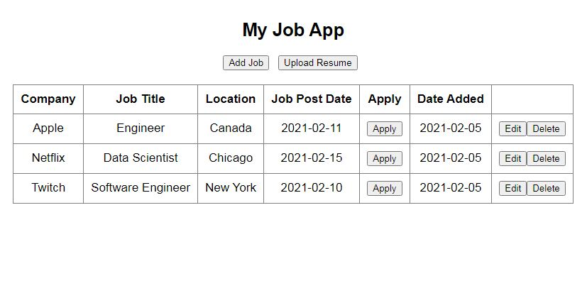

# JobApp

## Hi There! :wave:

I built the JobApp duringone of my many job searching sprees.I got tired of navigating so many webpages and shuttling between my notpad and excel sheets, so I thought, 'Why not build a Job Tracker App?'.

Although still in progress, the JobApp was built to help job seekers note down and track their many job applications.

The 'Add Job' button pops up a form when clicked, here you fill in the details and description of your desired role and click 'Submit' to save it.

The project was built using the Flask microframework and the database to store the jobs was built using Flask SQLAlchemy library and SQLlite. All dependencies are listed in the 'requirements.txt' file.

## Testing JobApp on Your Browser

1. Once you clone the repo on your computer, open the file using an IDE (I personally prefer VSCode)

2. Open the project in your command line by pressing 'Ctrl + `"

3. At the directory prompt, type venv\Scripts\activate.bat (Windows) to enter the virtual enviroment

4. Type app.py at the directory prompt. The app will prepare to run and generate a domain address: http://127.0.0.1:5000/

5. Visit the address in your browser to view the project.

**Yay!!! Thanks for stopping by :rocket:**
